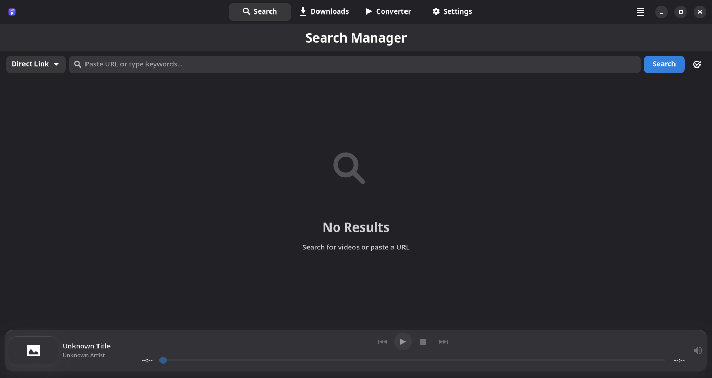
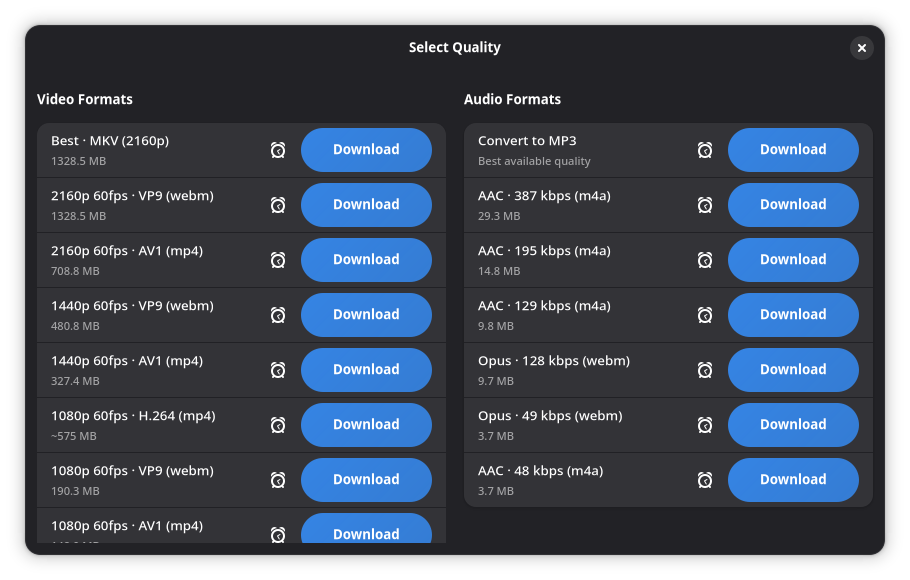
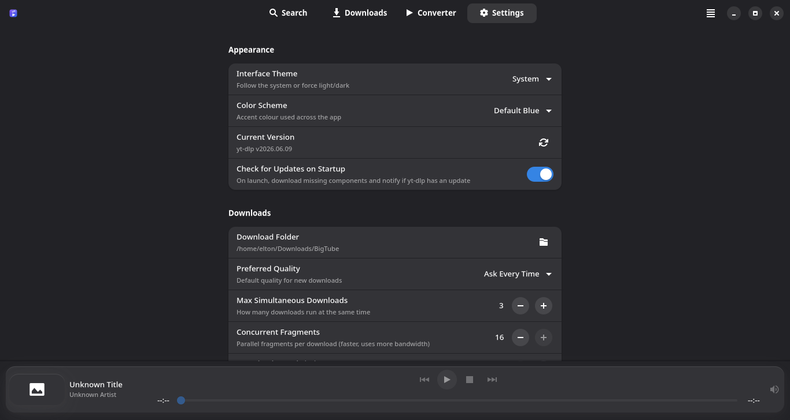
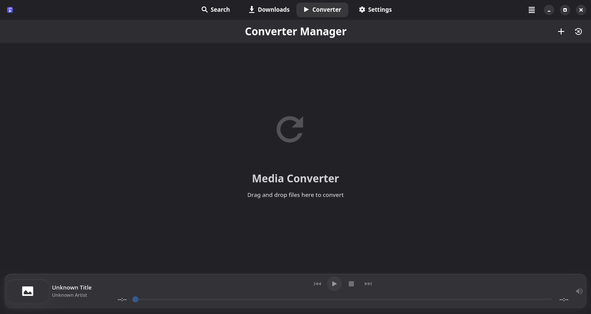
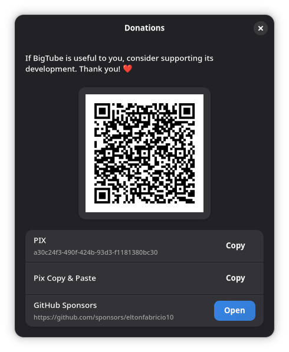

<p align="center">
  
</p>

<p align="center">
  <a href="../README.md">English</a> · <a href="README.pt-BR.md">Português (BR)</a> · <a href="README.es.md">Español</a> · <b>Français</b>
</p>

# 🎬 BigTube

> **Le téléchargeur multimédia ultime pour Linux**

**BigTube** est une application de bureau moderne, rapide et élégante, développée en **Rust** avec **GTK4**, **Libadwaita** et **GStreamer**. Conçu pour celles et ceux qui n'acceptent rien de moins que la perfection lorsqu'ils téléchargent du contenu depuis Internet, BigTube transforme la complexité de `yt-dlp` en un outil intuitif et puissant — un binaire natif et rapide.

---

## 📸 Captures d'écran

<p align="center">
  
</p>

<p align="center">
  
  &nbsp;
  
</p>

<p align="center">
  
  &nbsp;
  
</p>

---

## ✨ Fonctionnalités

### 🔍 Recherche et découverte
- **Recherche YouTube intégrée** - Recherchez des vidéos sans ouvrir de navigateur
- **Recherche YouTube Music** - Trouvez des chansons, des clips musicaux et des podcasts
- **Liens directs** - Prise en charge de plus de 400 sites via URL
- **Playlists dans les résultats** - Les recherches YouTube renvoient des playlists en plus des vidéos ; cliquez sur **Ouvrir la playlist** pour ouvrir une fenêtre modale contenant toutes les vidéos, avec des boutons **Tout lire**, **Tout télécharger** et un mode de sélection permettant de ne télécharger que les éléments cochés
- **Playlists par lien** - Collez un lien de playlist YouTube (`playlist?list=` ou `watch?v=...&list=`) et la recherche liste toutes ses vidéos

### ⬇️ Téléchargements avancés
| Fonctionnalité | Description |
|---------|-------------|
| **Qualité vidéo** | 4K (2160p), 2K (1440p), 1080p, 720p, 480p, 360p, 240p, 144p |
| **Formats audio** | MP3, M4A avec extraction haute qualité |
| **Métadonnées** | Intégration automatique des tags, de l'album et de l'artiste |
| **Sous-titres** | Téléchargement et intégration des sous-titres (automatiques + manuels) |
| **Reprise** | Reprise des téléchargements interrompus |

### 🔄 Convertisseur multimédia
- Conversion vidéo vers vidéo (MKV, MP4, WebM)
- Extraction et conversion audio
- Fusion des sous-titres
- File d'attente de conversion par lot
- Progression en temps réel avec estimation du temps restant (ETA)

### 📺 Lecteur intégré
- Moteur de lecture **GStreamer** (natif, intégré à GTK4)
- Aperçu vidéo avant le téléchargement
- Navigation dans la playlist (Précédent / Lecture-Pause / **Arrêt** / Suivant)
- Fenêtre vidéo détachable

### 🎨 Personnalisation de l'apparence
| Mode | Description |
|------|-------------|
| **Thème** | Clair / Sombre / Suivre le système |
| **Couleurs** | Plus de 10 schémas de couleurs (Par défaut, Violet, Émeraude, Nordique, Gruvbox, Catppuccin, Dracula, Tokyo Night, Rosé Pine, Solarized, Monokai, Cyberpunk, Marque BigTube) |
| **Style** | Interface moderne avec effet glassmorphism |

### 📊 Gestion
- Historique des téléchargements
- Historique des conversions
- Historique des recherches
- Option pour effacer automatiquement les données à la fermeture

---

## 🛠️ Technologies

| Technologie | Rôle |
|------------|------|
| **Rust 2021** | Cœur de l'application (binaire natif) |
| **GTK4 + Libadwaita** | Interface native GNOME |
| **GStreamer** | Moteur de lecture |
| **yt-dlp** | Moteur de téléchargement |
| **FFmpeg** | Conversion multimédia |
| **Cargo** | Compilation et gestion des dépendances |

> Le projet est un workspace Cargo composé de trois crates : **`bigtube-core`** (logique/moteur), **`bigtube-cli`** (binaire `bigtube` sans interface) et **`bigtube-gui`** (interface graphique `bigtube-gui`).

---

## 🚀 Installation

### Arch Linux (AUR) — recommandé
Paquet binaire précompilé (`bigtube-bin`) : s'installe rapidement, **sans rien compiler** sur votre machine.
```bash
yay -S bigtube-bin
# ou
paru -S bigtube-bin
```

### Debian / Ubuntu (.deb)
Téléchargez le `.deb` depuis la [dernière version](https://github.com/eltonfabricio10/bigtube/releases/latest) et installez-le (les dépendances sont résolues automatiquement) :
```bash
sudo apt install ./bigtube_*_amd64.deb
```
> Compilé sur Ubuntu 24.04, il nécessite donc **Ubuntu 24.04+** ou **Debian 13+** (GTK ≥ 4.12, libadwaita ≥ 1.5).

### Fedora (.rpm)
Téléchargez le `.rpm` depuis la [dernière version](https://github.com/eltonfabricio10/bigtube/releases/latest) et installez-le :
```bash
sudo dnf install ./bigtube-*.x86_64.rpm
```
> Compilé sur Fedora 40 (nécessite **Fedora 40+**). `ffmpeg` (extraction audio/conversion) se trouve dans [RPM Fusion](https://rpmfusion.org/) — activez-le et lancez `sudo dnf install ffmpeg` pour ces fonctions.

### Compilation depuis les sources (Cargo)
Nécessite la chaîne d'outils Rust (`rustup`) et les dépendances système listées ci-dessous.
```bash
# Cloner le dépôt
git clone https://github.com/eltonfabricio10/bigtube.git
cd bigtube/rust

# Compiler en mode release
cargo build --release --locked

# Les binaires se trouvent dans rust/target/release/
./target/release/bigtube-gui      # interface graphique
./target/release/bigtube --help   # mode sans interface (CLI)
```

Pour installer à l'échelle du système depuis une compilation locale :
```bash
sudo install -Dm755 target/release/bigtube-gui /usr/bin/bigtube-gui
sudo install -Dm755 target/release/bigtube     /usr/bin/bigtube
sudo install -Dm644 ../assets/bigtube.svg /usr/share/icons/hicolor/scalable/apps/bigtube.svg
sudo install -Dm644 ../assets/bigtube.png /usr/share/icons/hicolor/512x512/apps/bigtube.png
sudo install -Dm644 packaging/io.github.eltonfabricio10.bigtube.desktop /usr/share/applications/io.github.eltonfabricio10.bigtube.desktop
```

---

## ⌨️ Ligne de commande

BigTube fournit **deux binaires** :

| Binaire | Rôle |
|--------|------|
| `bigtube-gui` | Ouvre l'interface graphique |
| `bigtube` | Mode sans interface (téléchargement directement depuis le terminal, sans interface graphique) |

### Interface graphique
```bash
bigtube-gui      # ouvre la fenêtre BigTube
```

### Mode sans interface (`bigtube`)
```bash
bigtube -d <URL> [options]
```

| Option | Description |
|--------|-------------|
| `-d, --download URL` | Télécharge l'URL directement depuis le terminal, sans ouvrir la fenêtre |
| `-o, --output DIR` | Dossier de destination pour `--download` (par défaut : dossier configuré) |
| `--audio-only` | Avec `--download`, extrait l'audio au format MP3 |
| `--format FMT` | Avec `--download`, sélecteur de format personnalisé pour `yt-dlp -f` |
| `--yt-dlp-version` | Affiche la version de `yt-dlp` incluse |
| `--version` | Affiche la version de BigTube |
| `--help` | Affiche l'aide |

### Exemples
```bash
bigtube-gui                                      # opens the GUI
bigtube -d https://youtube.com/watch?v=...       # headless download
bigtube -d <url> -o ~/Music --audio-only         # headless MP3 audio
bigtube -d <url> --format "bestvideo+bestaudio"  # custom format
```

---

## 📁 Structure des dossiers

| Emplacement | Contenu |
|----------|----------|
| `~/.config/bigtube/` | Paramètres et historiques |
| `~/.config/bigtube/config.json` | Paramètres de l'application |
| `~/.config/bigtube/history.json` | Historique des téléchargements |
| `~/.local/share/bigtube/bin/` | Binaires (yt-dlp) |
| `~/.cache/bigtube/thumbnails/` | Cache des miniatures |
| `~/Downloads/BigTube/` | Dossier de téléchargement par défaut |

---

## ⚙️ Paramètres disponibles

Les préférences sont enregistrées dans `~/.config/bigtube/config.json`. Lorsque le fichier n'existe pas ou est corrompu, BigTube recrée la configuration avec des valeurs par défaut. Les chemins vides ou les options désactivées font simplement revenir l'application à son comportement par défaut.

### Apparence et composants
| Paramètre | Par défaut | Explication |
|---------|---------|-------------|
| **Thème de l'interface** | Suivre le système | Définit si l'interface utilise le thème du système, force un thème clair ou force un thème sombre. |
| **Schéma de couleurs** | Bleu par défaut | Modifie la palette/couleur d'accentuation de l'interface. Options : Bleu par défaut, Violet moderne, Vert émeraude, Orange éclatant, Rose vibrant, Cyan nordique, Neige nordique, Gruvbox rétro, Catppuccin Mocha, Dracula sombre, Tokyo Night, Rosé Pine, Solarized sombre, Monokai Pro, Cyberpunk néon et Marque BigTube. |
| **Version actuelle / mise à jour des composants** | Automatique | Affiche la version locale de `yt-dlp` et permet de mettre à jour les composants téléchargés par l'application, tels que `yt-dlp` et `deno`, dans `~/.local/share/bigtube/bin/`. |

### Recherche
| Paramètre | Par défaut | Explication |
|---------|---------|-------------|
| **Enregistrer l'historique des recherches** | Activé | Stocke vos recherches localement dans `search_history.json`, ce qui vous permet de réutiliser des requêtes précédentes. |
| **Activer les suggestions de recherche** | Activé | Affiche des suggestions au fur et à mesure de la saisie, en utilisant l'historique local des recherches. |
| **Nombre maximal de suggestions** | 10 | Définit combien de suggestions peuvent apparaître en même temps. Accepte des valeurs de 1 à 50. |
| **Effacer l'historique des recherches** | Action manuelle | Supprime toutes les entrées enregistrées de l'historique des recherches. Ne supprime pas les fichiers téléchargés. |
| **Nombre maximal de résultats de recherche** | 15 | Définit combien de résultats BigTube demande à `yt-dlp` pour les recherches textuelles. Accepte des valeurs de 5 à 100. |

### Téléchargements
| Paramètre | Par défaut | Explication |
|---------|---------|-------------|
| **Téléchargements simultanés** | 3 | Contrôle combien de vidéos peuvent être téléchargées en même temps. Accepte des valeurs de 1 à 10. |
| **Dossier de téléchargement** | `~/Downloads/BigTube/` | Définit l'emplacement où les fichiers téléchargés sont enregistrés. L'application crée le dossier si nécessaire. |
| **Surveillance du presse-papiers** | Désactivé | Détecte automatiquement les liens vidéo copiés dans le presse-papiers lorsque l'application est ouverte. |
| **Notifications système** | Activé | Contrôle les notifications système pour les événements de téléchargement et les erreurs. |
| **Qualité préférée** | Demander à chaque fois | Définit le format par défaut pour les nouveaux téléchargements. Peut demander à chaque téléchargement, télécharger la meilleure vidéo, ou choisir 4K, 2K, 1080p, 720p, 480p, 360p, 240p, 144p, ou télécharger uniquement l'audio au format MP3/M4A. |
| **Ajouter des métadonnées** | Désactivé | Tente d'intégrer l'artiste, l'album, la pochette et d'autres métadonnées dans les fichiers téléchargés. Nécessite `ffmpeg` ; s'il n'est pas installé, l'application ignore cette étape. |
| **Intégrer les sous-titres** | Désactivé | Tente de télécharger les sous-titres manuels et automatiques et de les intégrer dans le fichier final. Recherche actuellement les langues `en.*`, `pt.*` et `es.*`. Nécessite `ffmpeg`. |
| **Fragments simultanés** | 16 | Définit combien de fragments parallèles `yt-dlp` utilise par téléchargement. Accepte des valeurs de 1 à 16. Des valeurs plus élevées peuvent accélérer les téléchargements segmentés mais augmentent aussi l'utilisation du réseau. |
| **Limite de vitesse** | 0 Ko/s | Limite la vitesse de téléchargement en Ko/s. `0` signifie aucune limite. |
| **Commande de post-traitement** | Vide | Exécute une commande après le téléchargement à l'aide de `yt-dlp --exec`. Utilisez `{}` dans la commande pour représenter le fichier téléchargé. |
| **Fichier de cookies** | Vide | Utilise un fichier `cookies.txt` au format Netscape avec `yt-dlp --cookies`, utile pour le contenu nécessitant une session authentifiée. |
| **Cookies du navigateur** | Aucun | Importe les cookies directement depuis un navigateur détecté, tel que Firefox, Chrome, Chromium, Brave, Microsoft Edge, Vivaldi ou Opera, à l'aide de `yt-dlp --cookies-from-browser`. |
| **User-Agent** | Valeur BigTube par défaut | Remplace le User-Agent envoyé à `yt-dlp`. S'il est laissé vide, l'application utilise un User-Agent sûr basé sur Chrome. |
| **Proxy** | Vide | Achemine les recherches, les métadonnées, le lecteur et les téléchargements via le proxy indiqué. Accepte les URL `http`, `https`, `socks4`, `socks4a`, `socks5` et `socks5h`, par exemple `socks5://127.0.0.1:1080`. |
| **Enregistrer l'historique des téléchargements** | Activé | Conserve un enregistrement local des téléchargements dans `history.json`, utilisé par la vue historique/liste. |

#### Options de qualité
| Option | Explication |
|--------|-------------|
| **Demander à chaque fois** | Affiche le choix de qualité/format au moment du téléchargement. |
| **Meilleure qualité (MKV)** | Télécharge la meilleure combinaison vidéo et audio disponible et fusionne le résultat. |
| **4K, 2K, 1080p, 720p, 480p, 360p, 240p, 144p** | Privilégie la vidéo MP4/AVC à la résolution choisie avec l'audio M4A ; si ce format exact n'existe pas, `yt-dlp` utilise la meilleure alternative compatible définie dans le préréglage. |
| **Audio (MP3)** | Extrait uniquement l'audio, le convertit en MP3 haute qualité et tente d'intégrer la miniature. |
| **Audio (M4A)** | Télécharge uniquement l'audio, en privilégiant le codec/conteneur M4A. |

### Convertisseur multimédia
| Paramètre | Par défaut | Explication |
|---------|---------|-------------|
| **Enregistrer dans le dossier source** | Désactivé | Lorsqu'il est activé, le fichier converti est enregistré à côté du fichier d'origine. |
| **Dossier de sortie par défaut** | `~/Downloads/BigTube/Converted/` | Définit le dossier utilisé par le convertisseur lorsque « enregistrer dans le dossier source » est désactivé. |
| **Enregistrer l'historique des conversions** | Activé | Conserve un enregistrement local des conversions dans `converter_history.json`. |

### Stockage et confidentialité
| Paramètre | Par défaut | Explication |
|---------|---------|-------------|
| **Effacer les données à la fermeture** | Désactivé | À la fermeture de l'application, efface les historiques de téléchargement, de recherche et de conversion. Les paramètres de l'application sont conservés. Lorsqu'il est activé, les options « enregistrer l'historique » sont désactivées dans l'interface. |
| **Exporter l'historique** | Action manuelle | Enregistre l'historique des téléchargements dans un fichier JSON, par défaut `bigtube_history.json`. |
| **Importer l'historique** | Action manuelle | Restaure un historique de téléchargements à partir d'un fichier JSON valide. |
| **Effacer toutes les données de l'application** | Action manuelle | Supprime définitivement `config.json`, `history.json`, `search_history.json` et `converter_history.json`, recrée la configuration par défaut et quitte l'application. |

### Clés de `config.json`
| Clé | Valeur par défaut | Utilisée par |
|-----|---------------|---------|
| `download_path` | `~/Downloads/BigTube/` | Dossier de téléchargement |
| `theme_mode` | `system` | Thème de l'interface |
| `theme_color` | `default` | Schéma de couleurs |
| `default_quality` | `ask` | Qualité préférée |
| `max_concurrent_downloads` | `3` | Téléchargements simultanés |
| `max_download_history` | `100` | Max d’éléments dans la liste des téléchargements |
| `max_converter_history` | `50` | Max d’éléments dans la liste du convertisseur |
| `add_metadata` | `false` | Métadonnées sur les téléchargements |
| `embed_subtitles` | `false` | Sous-titres sur les téléchargements |
| `save_history` | `true` | Historique des téléchargements |
| `save_search_history` | `true` | Historique des recherches |
| `enable_suggestions` | `true` | Suggestions de recherche |
| `max_suggestions` | `10` | Nombre de suggestions |
| `search_limit` | `15` | Nombre de résultats de recherche |
| `save_converter_history` | `true` | Historique du convertisseur |
| `auto_clear_finished` | `false` | Effacer les historiques à la fermeture |
| `converter_path` | `~/Downloads/BigTube/Converted/` | Dossier de sortie du convertisseur |
| `use_source_folder` | `false` | Le convertisseur enregistre dans le dossier source |
| `monitor_clipboard` | `false` | Surveillance du presse-papiers |
| `concurrent_fragments` | `16` | Fragments parallèles par téléchargement |
| `rate_limit` | `0` | Limite de vitesse en Ko/s |
| `system_notifications` | `true` | Notifications système |
| `post_process_cmd` | `""` | Commande après téléchargement |
| `cookies_file` | `""` | Fichier de cookies |
| `cookies_browser` | `""` | Cookies du navigateur |
| `user_agent` | `""` | User-Agent personnalisé |
| `proxy` | `""` | Proxy |

> Compatibilité : les anciennes configurations comportant la clé `download_subtitles` sont automatiquement migrées vers `embed_subtitles`.

### Variables d’environnement
| Variable | Effet |
|----------|-------|
| `BIGTUBE_NO_FULL_REDRAW=1` | Désactive le contournement de redessin complet GSK. BigTube force des redessins complets pour éviter les « fantômes » au défilement (texte/vignettes figés) sur certaines combinaisons GTK4/Mesa/KWin. À utiliser si votre système n’est pas concerné, pour économiser CPU/batterie. |
| `GSK_RENDERER` | Variable GTK standard pour choisir le moteur de rendu (`gl`, `vulkan`, `cairo`, …) ; respectée telle quelle. |

---

## 📋 Dépendances système

Exécution (requises pour lancer le binaire) :

```bash
# Arch Linux
sudo pacman -S gtk4 libadwaita gstreamer gst-plugins-base gst-plugins-good \
               gst-plugins-bad gst-plugin-gtk4 yt-dlp
# optional: ffmpeg (audio extraction and media conversion)
sudo pacman -S ffmpeg

# Ubuntu/Debian (22.04+)
sudo apt install libgtk-4-1 libadwaita-1-0 \
                 gstreamer1.0-plugins-base gstreamer1.0-plugins-good \
                 gstreamer1.0-plugins-bad gstreamer1.0-gtk4 yt-dlp ffmpeg

# Fedora
sudo dnf install gtk4 libadwaita gstreamer1-plugins-base \
                 gstreamer1-plugins-good gstreamer1-plugins-bad-free \
                 yt-dlp ffmpeg
```

Pour **compiler depuis les sources**, ajoutez la chaîne d'outils Rust et les en-têtes de développement :

```bash
# Arch Linux
sudo pacman -S rustup gtk4 libadwaita gstreamer base-devel
rustup default stable
```

---

## 🤝 Contribuer

Les contributions sont les bienvenues ! N'hésitez pas à :

1. Ouvrir une **Issue** pour signaler des bugs ou suggérer des fonctionnalités
2. Soumettre une **Pull Request** avec des améliorations
3. Aider aux traductions

---

## 💖 Soutenir le projet

Si **BigTube** vous est utile, envisagez de soutenir son développement. Toute aide est la bienvenue ! ❤️

[](https://github.com/sponsors/eltonfabricio10)

**PIX** (clé aléatoire, pour les dons depuis le Brésil) :

```
a30c24f3-490f-424b-93d3-f1181380bc30
```

> Astuce : vous pouvez aussi retrouver ces options dans l'application, sous **Menu → Dons** (avec un QR code PIX et « Copier-Coller »).

---

## 📄 Licence

Ce projet est sous licence **MIT**. Consultez le fichier [LICENSE](LICENSE) pour plus de détails.

---

<p align="center">
  Réalisé avec ❤️ par <a href="https://github.com/eltonfabricio10">eltonff</a>
</p>
